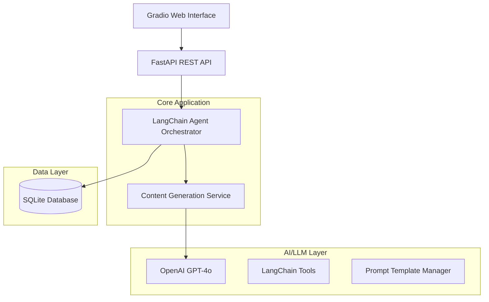

# ReelsBot

AI-powered agent that generates complete scripts for Instagram Reels, YouTube Shorts and TikTok videos, tailored to the chosen topic, tone and target audience.

## Overview

ReelsBot solves the pain point where creators and marketers waste hours brainstorming hooks, visuals, hashtags and still struggle to hit fast-moving trends. Our intelligent agent delivers an end-to-end Reels plan—idea, hook, storyline, timestamps, music suggestions and hashtag set—in seconds, keeping content on-brand and on-trend.

## Features

- **Multi-Platform Support**: Instagram Reels, YouTube Shorts, TikTok
- **Complete Content Generation**: Hook, storyline, script, timestamps
- **Smart Hashtag Suggestions**: Trending and niche-specific tags
- **Music Recommendations**: Built-in generic suggestions
- **Trend Analysis**: Heuristic-based trends
- **Quality Scoring**: AI-powered content quality assessment
- **Web Interface**: Gradio UI
- **REST API**: FastAPI backend
- **Monitoring**: Weights & Biases experiment tracking

## Tech Stack

- **AI/LLM**: OpenAI GPT-4o, LangChain
- **Backend**: Python, FastAPI
- **Frontend**: Gradio
- **Monitoring**: Weights & Biases
- **Deployment**: Docker
- **Testing**: pytest

## Prerequisites

- Python 3.11
- OpenAI API key
- Weights & Biases account (optional)

## Quick Start

### 1. Clone and Setup

```bash
git clone <repository-url>
cd Reels-bot
```

### 2. Environment Configuration

The project includes a pre-configured `.env` file. You only need to add your OpenAI API key.

```bash
nano .env
```

Required:
```env
OPENAI_API_KEY=sk-your-actual-openai-key
```

Optional:
```env
WANDB_API_KEY=your-wandb-key
```

Get your OpenAI API key from https://platform.openai.com/api-keys

### 3. Installation & Running

#### Option A: Docker (Recommended)

```bash
docker-compose up -d
docker-compose ps
docker-compose logs -f
docker-compose down
```

First-time build takes 5-10 minutes.

#### Option B: Local Development

Requires Python 3.11. Python 3.13+ has compatibility issues.

```bash
python3.11 -m venv .venv
source .venv/bin/activate
pip install -U pip
pip install -r requirements.txt

uvicorn app.main:app --host 0.0.0.0 --port 8000 --reload
python app/interface.py
```

#### Option C: Conda

```bash
conda create -n reels-bot-311 python=3.11 -y
conda activate reels-bot-311
pip install -U pip
pip install -r requirements.txt
```

### 4. Access the Application

- Web Interface: http://localhost:7860
- API Documentation: http://localhost:8000/docs
- Health Check: http://localhost:8000/health

## Usage

### Web Interface

1. Open http://localhost:7860
2. Fill in content parameters:
   - Topic
   - Platform (Instagram, YouTube, TikTok)
   - Tone
   - Target Audience
3. Click "Generate"
4. View results in tabs: Script, Tags & Music, Timeline, Metadata

### API Usage

```python
import requests

# Generate content
response = requests.post("http://localhost:8000/api/v1/content/generate", json={
    "topic": "Morning skincare routine",
    "platform": "instagram",
    "tone": "casual",
    "target_audience": "Young professionals",
    "include_music": True,
     "include_trends": false
})

content = response.json()
print(content["content"]["script"])
```

### Example Output

```json
{
  "hook": "Stop scrolling! This 2-minute morning routine will change your skin forever.",
  "storyline": "Start with the problem → introduce the solution → show the steps → reveal the transformation",
  "script": "Every morning, millions of people skip the most important 2 minutes for their skin...",
  "hashtags": ["skincare", "morningroutine", "glowup", "selfcare", "beauty"],
  "music_suggestions": [
    {
      "name": "Upbeat Morning Vibes",
      "artist": "Wellness Sounds",
      "energy_level": "medium"
    }
  ],
  "timestamps": [
    {"start": 0, "end": 3, "text": "Hook", "type": "opening"},
    {"start": 3, "end": 15, "text": "Main content", "type": "body"}
  ]
}
```

## Architecture



## Project Structure

```
ReelsBot/
├── app/
│   ├── api/
│   ├── core/
│   ├── models/
│   ├── services/
│   └── utils/
├── data/
│   ├── prompts/
│   └── templates/
├── tests/
│   ├── unit/
│   └── integration/
├── config/
├── scripts/
└── docker/
```

## Testing

```bash
pytest -q
pytest --cov=app --cov-report=html
pytest tests/unit/
pytest tests/integration/
```

## Deployment

### Docker Production

```bash
docker-compose --profile monitoring up --build -d
docker-compose logs -f reelsbot-api
```

## Screenshots

Add screenshots of the interface to `screenshots/` folder:
- `main-interface.png`
- `script-output.png`
- `tags-music.png`
- `timeline.png`
- `api-docs.png`

Reference them in README:
```markdown

```

## Troubleshooting

### Common Issues

**1. ModuleNotFoundError: No module named 'app'**

Fixed in Dockerfile with `PYTHONPATH=/app`. For local development:
```bash
export PYTHONPATH=/path/to/Reels-bot
```

**2. WANDB Authentication Error**

Weights & Biases is optional. Remove `WANDB_API_KEY` from `.env` or ignore the warning.

**3. Python 3.13 compatibility issues**

Use Docker or Python 3.11:
```bash
pyenv install 3.11.9
pyenv local 3.11.9
```

**4. UI container keeps restarting**

Check logs:
```bash
docker-compose logs reelsbot-ui
```

**5. API returns 401 errors**

Add valid OpenAI API key to `.env` and restart:
```bash
docker-compose restart
```

**6. Port already in use**

Change ports in `docker-compose.yml`:
```yaml
ports:
  - "8001:8000"
  - "7861:7860"
```

### Debug Commands

```bash
docker-compose ps
docker-compose logs -f
docker-compose logs -f reelsbot-api
docker-compose restart
docker-compose down && docker-compose build --no-cache && docker-compose up -d
curl http://localhost:8000/health
```

## Recent Updates

### Fixed Issues:
- Docker PYTHONPATH configuration
- Matplotlib cache permissions
- Weights & Biases optional initialization
- docker-compose.yml validation
- Python 3.13 compatibility notes
- SECRET_KEY pre-generated in `.env`

### Ready to Deploy:
- Docker containers build successfully
- API responds to health checks
- UI launches without errors
- Database initializes correctly
- Environment variables configured with defaults


