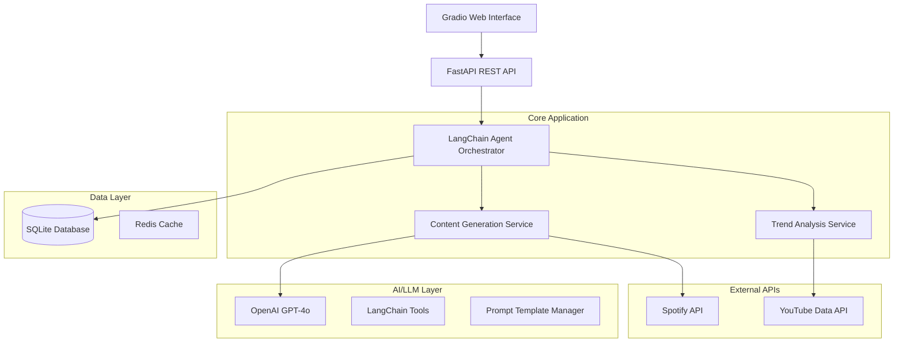

# 🎬 ReelsBot

AI-powered agent that generates complete scripts for Instagram Reels, YouTube Shorts and TikTok videos, tailored to the chosen topic, tone and target audience.

## 🚀 Overview

ReelsBot solves the pain point where creators and marketers waste hours brainstorming hooks, visuals, hashtags and still struggle to hit fast-moving trends. Our intelligent agent delivers an end-to-end Reels plan—idea, hook, storyline, timestamps, music suggestions and hashtag set—in seconds, keeping content on-brand and on-trend.

## Features

- **Multi-Platform Support**: Instagram Reels, YouTube Shorts, TikTok
- **Complete Content Generation**: Hook, storyline, script, timestamps
- **Smart Hashtag Suggestions**: Trending and niche-specific tags
- **Music Recommendations**: Spotify API integration
- **Trend Analysis**: YouTube Data API for current trends
- **Quality Scoring**: AI-powered content quality assessment
- **Web Interface**: Beautiful Gradio UI for easy interaction
- **REST API**: FastAPI backend for integration
- **Monitoring**: Weights & Biases experiment tracking

## 🛠️ Tech Stack

- **AI/LLM**: OpenAI GPT-4o, LangChain,
- **Backend**: Python, FastAPI
- **Frontend**: Gradio
- **APIs**: Spotify API, YouTube Data API
- **Monitoring**: Weights & Biases
- **Deployment**: Docker
- **Testing**: pytest

## 📋 Prerequisites

- Python 3.10+
- OpenAI API key
- (Optional) Spotify API credentials
- (Optional) YouTube Data API key
- (Optional) Weights & Biases account

## 🚀 Quick Start

### 1. Clone and Setup

```bash
git clone <repository-url>
cd ReelsBot
```

### 2. Environment Configuration

```bash
# Copy environment template
cp env.example .env

# Edit .env with your API keys
nano .env
```

Required environment variables:
```env
OPENAI_API_KEY=your-openai-api-key
SECRET_KEY=your-secret-key
```

Optional (for enhanced features):
```env
SPOTIFY_CLIENT_ID=your-spotify-client-id
SPOTIFY_CLIENT_SECRET=your-spotify-client-secret
YOUTUBE_API_KEY=your-youtube-api-key
WANDB_API_KEY=your-wandb-api-key
```

### 3. Installation & Running

#### Option A: Local Development
```bash
pip install -r requirements.txt

./scripts/start.sh

# Or start individually
./scripts/start.sh api    # API only
./scripts/start.sh ui     # UI only
```

#### Option B: Docker
```bash
# Development
./scripts/start.sh docker

# Production with monitoring
./scripts/start.sh docker-prod
```

### 4. Access the Application

- **Web Interface**: http://localhost:7860
- **API Documentation**: http://localhost:8000/docs
- **Health Check**: http://localhost:8000/health

## 🎯 Usage

### Web Interface

1. Open http://localhost:7860
2. Fill in content parameters:
   - **Topic**: Your content subject
   - **Platform**: Instagram, YouTube, or TikTok
   - **Tone**: Casual, professional, funny, etc.
   - **Target Audience**: Your intended viewers
3. Click "Generate Content"
4. Get complete script with hooks, hashtags, and music suggestions

### API Usage

```python
import requests

# Generate content
response = requests.post("http://localhost:8000/api/v1/content/generate", json={
    "topic": "Morning skincare routine",
    "platform": "instagram",
    "tone": "casual",
    "target_audience": "Young professionals",
    "include_music": True,
    "include_trends": True
})

content = response.json()
print(content["content"]["script"])
```

### Example Output

```json
{
  "hook": "Stop scrolling! This 2-minute morning routine will change your skin forever.",
  "storyline": "Start with the problem → introduce the solution → show the steps → reveal the transformation",
  "script": "Every morning, millions of people skip the most important 2 minutes for their skin...",
  "hashtags": ["skincare", "morningroutine", "glowup", "selfcare", "beauty"],
  "music_suggestions": [
    {
      "name": "Upbeat Morning Vibes",
      "artist": "Wellness Sounds",
      "energy_level": "medium"
    }
  ],
  "timestamps": [
    {"start": 0, "end": 3, "text": "Hook", "type": "opening"},
    {"start": 3, "end": 15, "text": "Main content", "type": "body"}
  ]
}
```

## 🏗️ Architecture



## 📁 Project Structure

```
ReelsBot/
├── app/
│   ├── api/                 # FastAPI routes
│   ├── core/                # Core configuration and utilities
│   ├── models/              # Database models
│   ├── services/            # Business logic services
│   └── utils/               # Utility functions
├── data/
│   ├── prompts/             # LLM prompt templates
│   └── templates/           # Content templates
├── tests/
│   ├── unit/                # Unit tests
│   └── integration/         # Integration tests
├── config/                  # Configuration files
├── scripts/                 # Utility scripts
└── docker/                  # Docker configurations
```

## 🧪 Testing

```bash
# Run all tests
pytest

# Run with coverage
pytest --cov=app --cov-report=html

# Run specific test types
pytest tests/unit/          # Unit tests only
pytest tests/integration/   # Integration tests only
```

## 🚀 Deployment

### Docker Production

```bash
# Build and deploy
docker-compose --profile monitoring up --build -d

# View logs
docker-compose logs -f reelsbot-api
```

 
